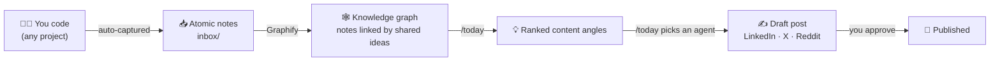

<div align="center">

# 🧠 second-brain-template

### Capture what you learn while you build. Turn it into content while you sleep.

**A second brain that runs itself.** As you code, it quietly writes down your
discoveries, wires them into a knowledge graph, and — when you ask — hands you
ready-to-post content angles for LinkedIn, X, and Reddit. All from your terminal,
inside [Claude Code](https://claude.com/claude-code).

No note-taking discipline. No blank page. No "I should really post about this" guilt.

<br>

```bash
git clone https://github.com/FrancescoBellingeri/second-brain-template
cd second-brain-template && ./bootstrap.sh
```

**One command. ~2 minutes. No API keys required.**

<br>


</div>

---

## The problem

You solve a gnarly bug at 2pm. You benchmark a model at 4pm. You make an
architecture call at 6pm. By Friday you've forgotten all three — and the LinkedIn
post that would've written itself is gone.

Your best content is a byproduct of your actual work. The problem is **capture**
and **recall**, not writing.

## The fix

This template turns your day into a pipeline:



1. **Capture happens on its own.** While you work in *any* repo, when a real
   discovery shows up — a decision, a fixed bug, a benchmark, an insight — a note
   is written to your vault automatically. You don't stop what you're doing.
2. **The graph connects the dots.** Notes that mention the same things get linked,
   so related ideas cluster into stories you'd never assemble by hand.
3. **`/today` gives you angles.** It ranks your recent notes by freshness, reach,
   and how connected they are, and proposes 3–5 things worth posting today.
4. **An agent writes the draft.** Pick an angle; the right specialist agent
   (LinkedIn / X / Reddit) drafts it in your voice. You approve, it's marked
   posted, and it never nags you again.

---

## See it in action

A benchmark note captured while working on an open-source project:

> *On the 110-question NL→MQL benchmark, a 3B-active model scores 0.877 XMaNeR —
> within 0.7 points of a ~1T model at ~1/30th the cost, because the context
> pipeline does the heavy lifting…*

`/today` surfaces it as a high-potential angle and hands it to the **LinkedIn
Content Creator** agent, which drafts:

> **A 3B-active model landed within 0.7 points of a ~1T model on our benchmark.**
> At roughly 1/30th the cost.
>
> Here's the part nobody building AI agents wants to hear: the model wasn't the reason…
> *(full post, in your voice, ready to paste)*

From a note you didn't even stop to write, to a post you didn't have to think about.

---

## Quickstart

**Requirements:** [Claude Code](https://claude.com/claude-code), `git`, `python3`.
Optional: [Obsidian](https://obsidian.md) (to see the graph), a Gemini API key
(for fully hands-off nightly graph refresh).

```bash
git clone https://github.com/FrancescoBellingeri/second-brain-template
cd second-brain-template
./bootstrap.sh
```

That's it. `bootstrap.sh` sets up everything and is safe to re-run:

<details>
<summary><b>What the one command actually does</b></summary>

- Creates your vault at `~/second-brain/brain` (a local git repo — add a remote
  whenever you want backup/sync)
- Installs [Graphify](https://github.com/safishamsi/graphify) (the graph engine)
- Installs the slash commands `/capture`, `/today`, `/review` into Claude Code
- Installs the helper scripts (`brain-commit`, `today-candidates`)
- Turns on **passive capture** everywhere by adding a small block to your global
  `~/.claude/CLAUDE.md`
- Installs the 5 content agents from
  [agency-agents](https://github.com/msitarzewski/agency-agents)
- Schedules a nightly commit of your vault (default 21:30)
- Points Obsidian at your vault (graph internals hidden)

Then **restart Claude Code** so the new agents and capture rules load.
</details>

**Want backup & sync across machines?** Create an empty **private** git repo for
your notes and point the installer at it:

```bash
BRAIN_REPO=git@github.com:you/my-brain.git ./bootstrap.sh
```

Your notes stay in *your* private repo. This template — the public skeleton — never
sees them.

---

## The commands

| Command | When | What it does |
|---|---|---|
| *(nothing)* | as you code | **Passive capture** — discoveries become notes automatically, in any project |
| `/capture` | end of a session | Sweeps the conversation for anything capture missed, then refreshes the graph |
| `/today [project]` | when you want to post | Ranks recent notes into 3–5 content angles and hands the one you pick to an agent |
| `/review` | weekly | Triage notes older than 7 days: promote, archive, or delete |
| `/graphify <vault>` | anytime | (Re)build the knowledge graph |

---

## How it works (for the curious)

**Two sources, kept separate — on purpose.**

- The **Graphify knowledge graph** answers *"what relates to what."* Notes become
  nodes; the entities they mention (your classes, concepts, metrics) become shared
  nodes that link notes together. `/today` uses this for "connectedness".
- The **note frontmatter** (plain YAML in each file) holds the *editorial* metadata
  — date, `content_potential`, which channels, what's already `posted`. `/today`
  uses this for filtering and ranking. Editorial state never pollutes the graph.

**Key-free by default.** Graphify's semantic extraction runs on Claude Code's own
subagents — *Claude itself is the model*. No provider API key, no per-token bill.
Set a `GEMINI_API_KEY` only if you want the graph to also refresh headlessly at
night; without one, the graph refreshes whenever you run `/capture` or `/today`.

**Your note = one atomic idea.** 5–15 lines, one thought, entities named
consistently (there's a `projects/naming.md` registry so "MyClass" always links to
"MyClass"). Small notes make a rich graph.

<details>
<summary><b>Vault layout</b></summary>

```
inbox/        atomic notes, flat, YYYY-MM-DD-slug.md
permanent/    notes promoted by /review
projects/     naming.md — your canonical entity names, one section per project
clips/        external articles / videos
templates/    the note frontmatter
CLAUDE.md     the passive-capture rules
```
The project is a frontmatter field, never a folder — so one flat inbox serves every
project you work on.
</details>

<details>
<summary><b>The note format</b></summary>

```yaml
---
type: insight | decision | error | benchmark | idea
project: myproject          # canonical, lowercase
date: 2026-07-09
status: fresh               # fresh → promoted | archived
content_potential: high     # high | medium | low | none
channels: [linkedin]        # optional
posted: []                  # e.g. [linkedin-2026-07-10]
---
One atomic idea, in your words.
```
</details>

---

## Configuration

Everything is an environment variable — nothing personal is baked into this repo.

| Variable | Default | Meaning |
|---|---|---|
| `VAULT` | `~/second-brain/brain` | where your notes live |
| `BRAIN_REPO` | *(none)* | private git URL for your notes (omit for a local-only vault) |
| `COMMIT_TIME` | `21:30` | nightly auto-commit time (`HH:MM`) |
| `GEMINI_API_KEY` | *(none)* | optional — enables headless nightly graph refresh |

```bash
VAULT=~/brain COMMIT_TIME=23:00 ./bootstrap.sh
```

---

## Privacy

- **Your notes are yours.** They live in your vault (local, or your own private
  repo). This public template only ships structure, templates, and the installer.
- **No data leaves your machine by default.** Key-free graph building uses your
  local Claude Code session. Only if you opt into a Gemini key does note text go to
  Google for extraction.

---

## FAQ

<details>
<summary><b>Do I need to be technical?</b></summary>

To install: copy-paste two lines and restart Claude Code. To use: just work — the
capture is passive, and the commands are one word each. If you can run `git clone`,
you're set.
</details>

<details>
<summary><b>Do I need an API key or a subscription for the graph?</b></summary>

No. The graph is built by Claude Code itself (the session is the model). A Gemini
key is optional and only adds hands-off nightly refresh.
</details>

<details>
<summary><b>Does it only work for one project?</b></summary>

No — it captures across every project you touch. The project is a tag in each note,
so one vault covers all your work.
</details>

<details>
<summary><b>Will it post for me automatically?</b></summary>

No. It drafts. You always approve before anything is "published" — then the source
note is marked `posted` so it's never suggested again.
</details>

<details>
<summary><b>What if I already keep notes?</b></summary>

Point `VAULT` at your existing folder. `bootstrap.sh` only *adds* what's missing and
never overwrites your content.
</details>

---

## Built on

- **[Graphify](https://github.com/safishamsi/graphify)** — the knowledge-graph engine
- **[agency-agents](https://github.com/msitarzewski/agency-agents)** — the content specialist agents
- **[Claude Code](https://claude.com/claude-code)** — the runtime that ties it together
- **[Obsidian](https://obsidian.md)** — optional graph viewer

## Contributing

Issues and PRs welcome — better capture heuristics, more content channels, new
ranking signals. Keep personal content out of this repo; it's the public skeleton.

## License

MIT — see [LICENSE](LICENSE). Do anything, just don't blame us.

<div align="center">
<br>
<b>Stop losing your best ideas to the scroll of a terminal.</b><br>
⭐ Star it, fork it, build in public.
</div>
