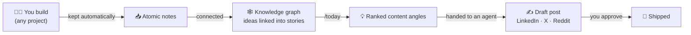

<div align="center">

# kepra

### keep the work, ship the story.

**From terminal to timeline.** kepra quietly keeps the discoveries you make while
you code — the decisions, the fixed bugs, the benchmarks — and turns them into
ready-to-post content for LinkedIn, X, and Reddit. Inside
[Claude Code](https://claude.com/claude-code). On autopilot.

Not a note app. Not memory for your agent. **A content engine for people who build.**

<br>

```bash
git clone https://github.com/FrancescoBellingeri/kepra
cd kepra && ./bootstrap.sh
```

**One command. ~2 minutes. No API keys.**

<br>


</div>

---

## You didn't write this. kepra did.

From a benchmark you ran on a Tuesday — captured automatically, never typed by hand:

> **A 3B-active model landed within 0.7 points of a ~1T model on our benchmark.**
> At roughly 1/30th the cost.
>
> Here's the part nobody building AI agents wants to hear: the model wasn't the reason…
>
> *(full post, in your voice, ready to paste)*

You ran the benchmark. kepra kept it, connected it, and — when you asked — handed
you the post. **From terminal to timeline.**

---

## The problem

You solve a gnarly bug at 2pm. You benchmark a model at 4pm. You make an
architecture call at 6pm. By Friday all three are gone — and so is the post that
would've written itself.

Your best content is a **byproduct of your actual work.** The bottleneck was never
writing. It's *keeping* what's worth keeping, and *recalling* it when it's time to post.

That's the whole job kepra does.

---

## How it works



**1. KEEP — capture happens on its own.**
While you work in *any* repo, when a real discovery shows up — a decision, a fixed
bug, a benchmark, an insight — kepra writes it down for you. No note-taking, no
interruption. You just keep building.

**2. CONNECT — the dots link themselves.**
Notes that mention the same things get wired into a knowledge graph, so related
discoveries cluster into stories you'd never assemble by hand.

**3. SHIP — one word gets you a draft.**
`/today` ranks your recent work by freshness, reach, and connectedness, and proposes
3–5 things worth posting. Pick one; the right specialist agent (LinkedIn / X / Reddit)
drafts it in your voice. You approve — it's marked shipped and never nags you again.

---

## Quickstart

**Requirements:** [Claude Code](https://claude.com/claude-code), `git`, `python3`.
Optional: [Obsidian](https://obsidian.md) (to see the graph), a Gemini API key
(for hands-off nightly refresh).

```bash
git clone https://github.com/FrancescoBellingeri/kepra
cd kepra
./bootstrap.sh
```

That's it. `bootstrap.sh` sets everything up and is safe to re-run.

<details>
<summary><b>What the one command actually does</b></summary>

- Creates your vault at `~/kepra` (a local git repo — add a remote anytime for backup/sync)
- Installs [Graphify](https://github.com/safishamsi/graphify) (the graph engine)
- Installs the commands `/capture`, `/today`, `/review` into Claude Code
- Installs the helper scripts (`brain-commit`, `today-candidates`)
- Turns on **automatic capture** everywhere via a small block in your global `~/.claude/CLAUDE.md`
- Installs the 5 content agents from [agency-agents](https://github.com/msitarzewski/agency-agents)
- Schedules a nightly commit of your vault (default 21:30)
- Points Obsidian at your vault (graph internals hidden)

Then **restart Claude Code** so the new agents and capture rules load.
</details>

**Want backup & sync across machines?** Point the installer at an empty **private**
git repo:

```bash
BRAIN_REPO=git@github.com:you/my-kepra.git ./bootstrap.sh
```

Your notes stay in *your* private repo. kepra — this public repo — never sees them.

---

## The commands

| Command | When | What it does |
|---|---|---|
| *(nothing)* | as you build | **Automatic capture** — discoveries become notes on their own, in any project |
| `/capture` | end of a session | Sweeps the conversation for anything capture missed, then refreshes the graph |
| `/today [project]` | when you want to post | Ranks recent work into 3–5 content angles and hands the one you pick to an agent |
| `/review` | weekly | Triage notes older than 7 days: promote, archive, or delete |

---

## Under the hood (for the curious)

**Two sources, kept separate — on purpose.**

- The **knowledge graph** answers *"what relates to what."* Your notes become nodes;
  the entities they mention (your classes, concepts, metrics) become shared nodes that
  link notes together. `/today` uses this for connectedness.
- The **note frontmatter** (plain YAML per file) holds the *editorial* metadata — date,
  content potential, channels, what's already shipped. `/today` uses this for ranking.
  Editorial state never pollutes the graph.

**Key-free by default.** Graph building runs on Claude Code's own subagents — *Claude
itself is the model.* No provider key, no per-token bill. A `GEMINI_API_KEY` is optional
and only adds a headless nightly refresh; without it, the graph refreshes whenever you
run `/capture` or `/today`.

**Your note = one atomic idea.** 5–15 lines, one thought, entities named consistently
(there's a `projects/naming.md` registry so the same thing always links to itself).
Small notes make a rich graph.

<details>
<summary><b>Vault layout</b></summary>

```
inbox/        atomic notes, flat, YYYY-MM-DD-slug.md
permanent/    notes promoted by /review
projects/     naming.md — your canonical entity names, one section per project
clips/        external articles / videos
templates/    the note frontmatter
CLAUDE.md     the capture rules
```
The project is a frontmatter field, never a folder — so one flat inbox serves every
project you touch.
</details>

<details>
<summary><b>The note format</b></summary>

```yaml
---
type: insight | decision | error | benchmark | idea
project: myproject          # canonical, lowercase
date: 2026-07-09
status: fresh               # fresh → promoted | archived
content_potential: high     # high | medium | low | none
channels: [linkedin]        # optional
posted: []                  # e.g. [linkedin-2026-07-10]
---
One atomic idea, in your words.
```
</details>

---

## Configuration

Everything is an environment variable — nothing personal is baked into this repo.

| Variable | Default | Meaning |
|---|---|---|
| `VAULT` | `~/kepra` | where your notes live |
| `BRAIN_REPO` | *(none)* | private git URL for your notes (omit for a local-only vault) |
| `COMMIT_TIME` | `21:30` | nightly auto-commit time (`HH:MM`) |
| `GEMINI_API_KEY` | *(none)* | optional — enables headless nightly graph refresh |

```bash
VAULT=~/brain COMMIT_TIME=23:00 ./bootstrap.sh
```

---

## Privacy

- **Your notes are yours.** They live in your vault (local, or your own private repo).
  This public repo ships only structure, templates, and the installer.
- **Nothing leaves your machine by default.** Key-free graph building uses your local
  Claude Code session. Only if you opt into a Gemini key does note text go to Google.

---

## FAQ

<details>
<summary><b>Isn't this just another second-brain / dev-memory tool?</b></summary>

No. Memory is the plumbing, not the point. Those tools help your *agent* recall context.
kepra's job is the other direction: turn what you build into content you publish. The
capture + graph exist to feed the posts.
</details>

<details>
<summary><b>Do I need to be technical?</b></summary>

To install: copy-paste two lines and restart Claude Code. To use: just build — capture
is automatic, and the commands are one word each. If you can run `git clone`, you're set.
</details>

<details>
<summary><b>Do I need an API key or a subscription for the graph?</b></summary>

No. The graph is built by Claude Code itself. A Gemini key is optional and only adds
hands-off nightly refresh.
</details>

<details>
<summary><b>Does it only work for one project?</b></summary>

No — it keeps discoveries across every project you touch. The project is a tag on each
note, so one vault covers all your work.
</details>

<details>
<summary><b>Will it post for me automatically?</b></summary>

No. It drafts. You always approve before anything is shipped — then the source note is
marked `posted` so it's never suggested again.
</details>

<details>
<summary><b>What if I already keep notes?</b></summary>

Point `VAULT` at your existing folder. `bootstrap.sh` only *adds* what's missing and
never overwrites your content.
</details>

---

## Built on

- **[Graphify](https://github.com/safishamsi/graphify)** — the knowledge-graph engine
- **[agency-agents](https://github.com/msitarzewski/agency-agents)** — the content specialist agents
- **[Claude Code](https://claude.com/claude-code)** — the runtime that ties it together
- **[Obsidian](https://obsidian.md)** — optional graph viewer

## Contributing

Issues and PRs welcome — better capture heuristics, more channels, new ranking signals.
Keep personal content out of this repo; it's the public skeleton.

## License

MIT — see [LICENSE](LICENSE).

<div align="center">
<br>
<b>Stop losing your best ideas to the scroll of a terminal.</b><br>
<b>keep the work. ship the story.</b><br>
⭐ Star it, fork it, build in public.
</div>
